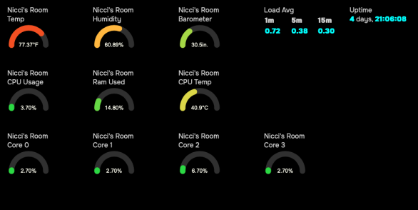
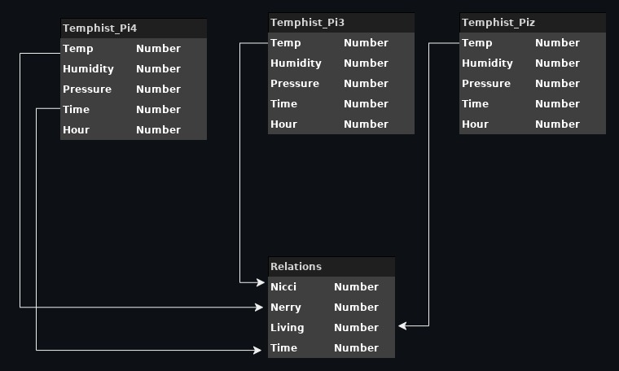
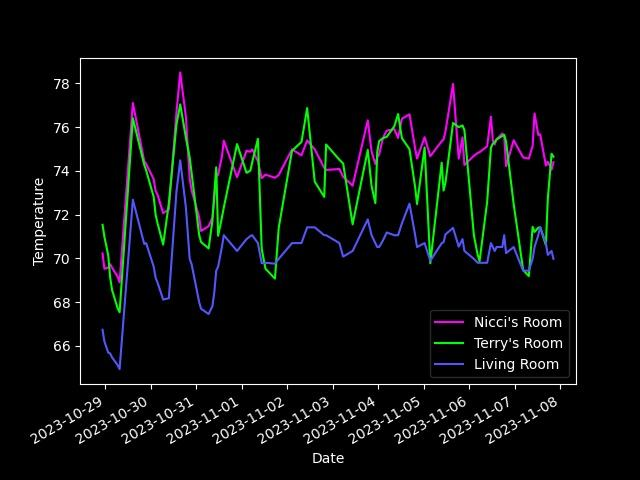

# Collection, Storage and Distribution of Sensor Data for Local and Remote Applications

## Abstract

Modern SOC systems such as Raspberry Pi run Linux and other Unix-like Operating systems. This allows for flexible hardware and software configuration to perform a variety of tasks including management and control of devices through the use of sensors. 

Having a filesystem entity for sensor data fits with the Unix philosophy of "everything is a file". This document intends to describe a system of doing this that is fairly portable across Unix-like systems.

This scheme intends to discuss a method along with code to export sensor data from any number of sources to a ramdisk in a consistent, structured format. Because this data can come from network sources, this allows for structuring and representing that data. 

### Audience
This is intended for people already familiar with coding, sensors, Linux and Raspberry Pi. Familiarity with the Python programming language and [JSON](assets/responsejson.md) is helpful too. 

### Terms used

* SensorFS - A ramdisk filesystem. For consistency purposes we will use /sensor as the mountpoint.
* Host - A local or remote host, used in examples without a domain name but there is nothing preventing from using fully qualified domain names. 
* [JSON](assets/responsejson.md) - Javascript Object Notation. A language agnostic and portable method of representing structured data. 


## Sensors

For this system I use Python to create interfaces to sensors, virtual sensors, system information and other information that can be read using the same interface. Sensors are derived from a base class of [Sensor](assets/sensor.py) and the data is read and/or written to using [JSON](assets/responsejson.md).

### Sensor types

There can be a variety of sensors to interface with any number of data sources. 

* [Hardware sensors](assets/i2cdev.md) by either directly manipulating hardware or through kernel interfaces.
* [Virtual sensors](assets/aggsens.md) which can do things like amalgamate other sensor data or perform calculations on one or more sensors to produce new data.
* Remote sensors are a type of virtual sensor in that there is no physical device to read and the data is collected elsewhere. 
* Information sensors can be used, as an example, do download forecasts and alerts from a weather service.

By using a class heirachy sensors can be written to perform a variety tasks. Given a protocol and an interface this system could also control home automation, robotics, and more.

The [code assets](assets/) have details and code about the components I'm using.


### Data Collection and Export

In [sen2fs.py](assets/sen2fs.md) a dictionary is recursed and each key/value pair is 
turned into a number of files in a base path. For a sensor that has temperature, humidity and pressure, called "aggregate" there will be a directory containing

```
├── aggregate.json
├── description
├── humidity
├── modinfo
├── name
├── pressure
├── temp
└── time
```

Each of these files, except aggregate.json are the keys for the [JSON](assets/responsejson.md) object, and each file contains those keys. The [JSON](assets/responsejson.md) file itself may be used to grab the entire dataset or each file may be used to to read single value. 

### Storing Sensor Data on Filesystems

The default on a Raspberry Pi is to run from a Micro Secure Digital Card (sd card) using the mmc interfaces. Frequent writes over time fatigues this media. It is possible to run a Pi using other storage but sensor data is very dynamic and persistency is not as important. 

Use of small ram disks provide for non-persistent data that does not stress the devices storage. 

To create, on a debian system, a ramdisk owned by the default user, an entry is added to /etc/fstab:
```
tmpfs /sensor	tmpfs nosuid,noexec,nodev,noatime,uid=1000,gid=1000,size=5M 0 0
```

This creates a 5M ramdisk owned by uid/gid 1000,1000 (the first login user created on debian systems) as owner.

### Limitations
Often sensors are used for controlling other devices and need a fine degree of timing. In cases like this it's likely better to work with the physical device. 

This framework is more about data presentation than acquisition.

### Collectors
Collectors are programs which collect sensor data from hardware and write to the sensor filesystem.

[Collectors](assets/sencollect.py) can also read files on that filesystem, use of the modification time can represent new data for example. That data can be used to control a device. 

**Collectors are not limited to hardware.**
In my setup I have three Raspberry Pi devices each with a temperature sensor of sometype. Each of these devices writes their data to their own sensorfs. The sensor filesystems from two devices are mounted on a master device which can instantiate a sensor using those files. I also have a sensor, for example, that parses Open Weather Map data to provide a "weather sensor". 

### Virtual Sensors

[Virtual Sensors](assets/aggsens.md) are sensors that take sensor data, massage it and export it to sensorfs. For example, temperature sensors to control HVAC systems. Instead of using a single data point, temperatures can be averaged and represented as a single point. 


## Storage Organization
To accomodate sharing sensor data with other hosts, each host, including the local host, a path on the root. Sensor data will be written to a class directory which contains the items for that sensor. The format is ```/sensor/host/class/item(s)```.

### Running Example

Currently, I have three Raspberry Pi devices. One, a Pi 3B+ and the hub, a Pi 4B+ and a Pi Zero W. Each have sensors on their i2c bus and export their data to a sensorfs orgnized ramdisk, which gets mounted on the pi4.

On the Pi's, the data local sensor data is written to /sensor/host/sensor, for pi3 and piz these paths are mounted on the local sensorfs.

My /sensor filesystem looks like:

```
/sensor/
├── pi3 -> /net/pi3/sensor/pi3
│   └── si7021
│       ├── description
│       ├── humidity
│       ├── modinfo
│       ├── name
│       ├── si7021.json
│       ├── temp
│       ├── tempc
│       └── time
├── pi4
│   ├── aggregate
│   │   ├── aggregate.json
│   │   ├── description
│   │   ├── humidity
│   │   ├── modinfo
│   │   ├── name
│   │   ├── pressure
│   │   ├── temp
│   │   └── time
│   ├── aht10
│   │   ├── aht10.json
│   │   ├── description
│   │   ├── humidity
│   │   ├── modinfo
│   │   ├── name
│   │   ├── temp
│   │   ├── tempc
│   │   └── time
│   ├── bmp280
│   │   ├── bmp280.json
│   │   ├── description
│   │   ├── modinfo
│   │   ├── name
│   │   ├── pressure
│   │   ├── temp
│   │   ├── tempc
│   │   └── time
└── piz -> /net/piz/sensor/piz
    ├── cputemp
    │   ├── cputemp.json
    │   ├── modinfo
    │   ├── name
    │   ├── temp
    │   └── time
    └── dht22
        ├── description
        ├── dht22.json
        ├── humidity
        ├── modinfo
        ├── name
        ├── temp
        ├── tempc
        └── time

```

This shows data for all three hosts (pi4, pi4 and piz). Each device runs a collector that talks to the sensor hardware and exports it to SensorFS. 

The entry for pi4, [aggregate](assets/aggsens.md), is a virtual sensor where three temperatures and two humidities are averaged and the barometric readings are all part of the "sensor's" data. 

These processes take little, in terms of resources, and the network traffic is negligable. But if deployed well, can provide a robust method of data collection and exchange transparent to the higher level application with just a few cases where administrator rights are used. 

## Remote Usage
These sensor data my be transmitted to other devices or hosts using, for example, MQTT. This broked approach pushes data to the interested client. 

## RESTful API Server

For a client-driven approach, I use a [RESTful API server](assets/rest.py) which returns [JSON](assets/responsejson.md) objects for use in, for example, web applications. 

Sensor data may be read via a REST server. In this case I use Flask behind Apache mod-wsgi. 
The organization of sensors is based on host->sensor name. 

API usage is made with a HTTP request with the form of
    http(s)://host:port/command?parameter1=value&parameter2=value...

The return value may be parsed as JSON to get native types. 

|command|Description|Parametera|Return type|
|---|---|---|---|
|hosts|List of hosts whose data is available.|None|array|
|list|List sensors for a specific host.|host|array|
|read|Read a sensor|host, sensor|JSON object|
|write|Write to a sensor|host, sensor, data|JSON object|


## Examples

Here are a few examples of some of my uses of the data gathered from these sensors.

### Dashboard

I have a dashboard app I wrote, primarily, in Javascript, that displays a number of sensors on a page per host. 

For each sensor, there are two for each host, an environmental sensor and a system information sensor, the app uses the REST API to read the sensors and then draw it usefully on the screen. 



## Storage, Extraction and Presenting Temperature History 

<small>(and other stupid SQL tricks)</small>

### Description

For each devcice hosting data, each hour, data is collected to a database, one table per device.
Each table has a similar structure. The difference is the temphist_pi4 data because it has a barometer. The other tables default pressure to zero. In this context we simply ignore it. See [code assets](assets/) for the sources used for this. 

### Data Organizaion

*Fig. 1. Database Tables*


As part of the database schema views are used to pull all three data sources into one virtual table which is then easy to select. 

### View Relationships

In my table a view is created as 

```sql
REATE VIEW tempHist2 as
SELECT a.time  AS time, a.temp AS Nicci, b.temp AS Terry, c.temp AS Living
FROM temphist_pi4 AS a
LEFT JOIN temphist_pi3 AS b ON a.time = b.time
LEFT JOIN temphist_piz AS c ON a.time = c.time where a.temp is not null and b.temp is not null and c.temp is not null

```
* temphist_pi3, temphist_pi4, and temphist_piz tables are related by the time column, which is the primary key in each of these tables.
* tempHist view is constructed using the following relationships:
* It joins temphist_pi4 with temphist_pi3 on the time column (a.time = b.time).
* It also joins temphist_pi4 with temphist_piz on the time column (a.time = c.time).
* The view selects and aliases columns from these tables.
* tempHist2 view is constructed similarly:
* It joins temphist_pi4 with temphist_pi3 on the time column (a.time = b.time).
* It also joins temphist_pi4 with temphist_piz on the time column (a.time = c.time).
* The view selects and aliases columns from these tables.

Visually it looks like this:

*Fig. 2. View Relationships*


Now, to get a full history it's a simple as: 
```sql
SELECT * FROM tempHist; 
```

This makes client code much simpler and less error prone. 

*Fig. 3. Example Chart*


## Code Assets

* [aggsens.py](aggsens.md) - Example of Virtual Sensor combinding values from two sensors and averaging common data
* [generate.sh](generate.sh) - generate.sh
* [histcollect.py](histcollect.py) - histcollect
* [histread.py](histread.py) - histread.py
* [i2cdev.py](i2cdev.md) -  Example of hardware sensors accessed through Linux sysfs
* [response.json](responsejson.md) - response.json
* [runtemphist.sh](runtemphist.sh) - runtemphist.sh
* [schema.sql](schema.sql) - schema.sql
* [sen2fs.py](sen2fs.md) - Export a dict by property to path
* [sencollect.py](sencollect.py) - Example Collector
* [sensor.py](sensor.py) - Base class for Sensors

### Notes on Environment
This was built on a Raspberry Pi4+ B running *Raspbian Buster*, *Sqlite3 3.34.1*, and *Python 3.9*. These documents were build using *pygrip*, *MacDown Markdown Editor*, and *draw.io diagram editor*. 

