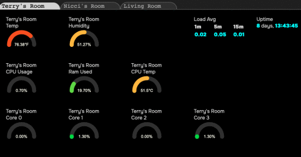

# Collection, Storage and Distribution of Sensor Data for Local and Remote Applications



## Contents
  * [Abstract](#abstract)
    + [Audience](#audience)
    + [Terms used](#terms-used)
  * [Sensors](#sensors)
    + [Sensor types](#sensor-types)
      - [Virtual Sensors](#virtual-sensors)
    + [Data Collection and Export](#data-collection-and-export)
    + [Storing Sensor Data on Filesystems](#storing-sensor-data-on-filesystems)
    + [Limitations](#limitations)
  * [Collectors](#collectors)
  * [Storage Organization](#storage-organization)
    + [Running Example](#running-example)
  * [Remote Usage](#remote-usage)
    + [MQTT](#mqtt)
    + [RESTful API Server](#restful-api-server)
  * [HomeKit Integration](#HomeKit-Integration)
  * [Check Sensor Health](#health-checking)
  * [Storage, Extraction and Presenting Temperature History](#storage-extraction-and-presenting-temperature-history)
    + [Data Organization](#data-organization)
    + [View Relationships](#view-relationships)
  * [Code Assets](#code-assets)
  * [Figures](#figures)
  * [Trademarks, Copyrights and other Ownerships](#trademarks-copyrights-and-other-ownerships)

## Abstract

Systems on a Chip, or SOCs, are systems that have various hardware parts on one chip. Generally, these devices allow for connecting peripherals through a variety of busses including general purpose input/output bus, or GPIO. These devices are getting quite sophisticated and can run various software environments. For the purposes of this document, I will be discussing Raspberry Pi devices. A convenient feature of these devices is that they can run Unix-like operating systems, such a Linux. I have used Raspbian Bullseye in my development. This is a 'spin' of Debuan Bullseye with enhancements from the Raspberry Pi devs.

Because these devices can run Linux, it allows for flexible hardware and software configuration to perform a variety of tasks including management and control of devices through the use of sensors. With devices like Raspberry Pi 4 and Pi 5 the ability to build and scale IoT Gateway Applications becomes a simpler task and with device sensor data unified in a singular format, these applications can decouple themselves from the physical aspect of data collection and device control. 

Having a filesystem entity for sensor data fits with the Unix philosophy of "everything is a file".  This document intends to describe a system of doing this that is fairly portable across Unix-like systems. By using in-ram filesytesm (ramdisks) file system like objects are the most portable way of storing data on a local system. For most applications, this data can be shared using regular file sharing technologies.

This scheme intends to discuss a method along with code to export sensor data from any number of sources to a ramdisk in a consistent, structured format. Because this data can come from network sources, this allows for structuring and representing that data. I'm using Python and [JSON](assets/responsejson.md) to collect and serialize data, however, nothing described is exclusive to these technologies; Any language and data format can be used. The focus is really on storage and transport.

In this document, I discuss fairly simple sensors. By no means should this be considered an exhaustive list of sensors that can be used or means to interface them. 

### Audience
This is intended for people already familiar with coding, sensors, Linux and Raspberry Pi. Familiarity with the [Python](https://www.learnpython.org) programming language and [JSON](assets/responsejson.md) is helpful too. 

Be aware that while code is presented, this is not a code repository and some linked files are actually markdown files to better illustrate the code. Some of the code files presented are simplified from their production counterparts and are used for illustrative purpose. 

### Terms used

* SensorFS - A ramdisk filesystem. For consistency purposes we will use /sensor as the mount point.
* Host - A local or remote host, used in examples without a domain name but there is nothing preventing from using fully qualified domain names. 
* [JSON](assets/responsejson.md) - Javascript Object Notation. Despite the name. JSON is a language agnostic and portable method of representing structured data.

## Sensors

For this system I use Python to create interfaces to sensors, virtual sensors, system information and other information that can be read using the same interface. Sensors are derived from a base class of [Sensor](assets/sensor.py) and the data is read and/or written to using [JSON](assets/responsejson.md).

The classes and sensors described here do not manipulate the sensor hardware directly (with the exception of rgbsen) and rely on kernel and system interfaces to access sensor data and in a consistent format.

### Sensor types

There can be a variety of sensors to interface with any number of data sources. 

* [Hardware sensors](assets/i2cdev.md) by either directly manipulating hardware or through kernel interfaces.
* [Virtual Sensors](#Virtual-Sensors) which can do things like amalgamate other sensor data or perform calculations on one or more sensors to produce new data or represent any set of structured data..
* Remote sensors are a type of virtual sensor in that there is no physical device to read and the data is collected elsewhere. 
* I/O Sensors where data can be supplied to a device to perform an operation. My example I/O sensor, [rgbsen.py](assets/rgbsen.md), controls an RGB LED.

The latter is very simplisic but it does show a method of providing a command interface to a write sensor.  

#### Virtual Sensors

[Virtual Sensors](assets/aggsens.md) are sensors that take sensor data, massage it and export it to SensorFS. For example, temperature sensors to control HVAC systems. Instead of using a single data point, temperatures can be averaged and represented as a single point. 

Information specific to a system, event, or other package of information can be expressed as "sensor" data. Examples of this are

* In some cases it's valuable to aggregate sensor data as one dataset. An example of this is my [aggregate](assets/aggsens.md) sensor, a virtual sensor which averages two sensors as one.
* System information, such as cpu load or other system monitoring data can be expressed as a virtual sensor. For example, [cpuinfo.py](assets/cpuinfo.py) provides cpu load. This is how my [Dashboard App](#Figure-1) gets the cpu loads. 
* Data from remote sources such as other sensors, weather, and others.

By using a class hierarchy sensors can be written, with a standard interface, to perform a variety tasks. Given a protocol and an interface this system could also control home automation, robotics, and more.

The [code assets](assets/) have details and code as examples of  the system I'm using.

### Data Collection and Export

In [sen2Fs.py](assets/sen2Fs.md) a dictionary is recursed and each key/value pair is 
turned into a number of files in a base path. For a sensor that has temperature, humidity and pressure, called "aggregate" there will be a directory containing

```
├── aggregate.json
├── description
├── humidity
├── modinfo
├── name
├── pressure
├── temp
└── time
```

Each of these files, except aggregate.json are the keys for the [JSON](assets/responsejson.md) object, and each file contains those keys. The [JSON](assets/responsejson.md) file itself may be used to grab the entire dataset or each file may be used to to read single value. 

### Storing Sensor Data on Filesystems

The default on a Raspberry Pi is to run from a Micro Secure Digital Card (sd card) using the mmc interfaces. Frequent writes over time fatigues this media. It is possible to run a Pi using other storage but sensor data is very dynamic and persistency is not as important. 

The use of small ram disks provide for non-persistent data does not stress the devices storage. 

To create, on a Debian system, a ramdisk owned by the default user, an entry is added to /etc/fstab:
```
tmpfs /sensor	tmpfs nosuid,noexec,nodev,noatime,uid=1000,gid=1000,size=5M 0 0
```

This creates a 5M ramdisk owned by uid/gid 1000,1000 (the first login user created on Debian systems as owner. This is our SensorFS.

### Data Usage
One of the reasons to export this data to a filesytem is to allow for multiple processes to 
read the sensor data from SensorFS, rather than the device directly. This allows for the collector to manage timing and any other conditions that might arise with reading the sensor. This is where [senfs.py](assets/senfs.py) comes in. This allows a sensor object ot be created from those filesystem entiries. 


### Limitations
Often sensors are used for controlling other devices and need a fine degree of timing. In cases like this it's likely better to work with the physical device. 

This framework is more about data presentation than acquisition.

### Collectors
Collectors are programs which collect sensor data from hardware and write to the sensor filesystem.

[Collectors](assets/sencollect.py) can also read files on that filesystem, use of the modification time can represent new data for example. That data can be used to control a device. 

In my setup I have three Raspberry Pi devices each with a temperature sensor of some type. Each of these devices writes their data to their own SensorFS. The sensor filesystems from two devices are mounted on a master device which can instantiate a sensor using those files. I also have a sensor, for example, that parses Open Weather Map data to provide a "weather sensor". 

## Storage Organization
To accomodate sharing sensor data with other hosts, each host, including the local host, a path on the root. Sensor data will be written to a class directory which contains the items for that sensor. The format is ```/sensor/host/class/item(s)```.

### Running Example

Currently, I have three Raspberry Pi devices. One, a Pi 3B+ and the hub, a Pi 4B+ and a Pi Zero W. Each have sensors on their i2c bus and export their data to a SensorFS organized ramdisk, which gets mounted on the pi4.

On the Pi's, the data local sensor data is written to /sensor/host/sensor, for pi3 and piz these paths are mounted on the local SensorFS.

My /sensor filesystem looks like:

```
/sensor/
├── pi3 -> /net/pi3/sensor/pi3
│   └── si7021
│       ├── description
│       ├── humidity
│       ├── modinfo
│       ├── name
│       ├── si7021.json
│       ├── temp
│       ├── tempc
│       └── time
├── pi4
│   ├── aggregate
│   │   ├── aggregate.json
│   │   ├── description
│   │   ├── humidity
│   │   ├── modinfo
│   │   ├── name
│   │   ├── pressure
│   │   ├── temp
│   │   └── time
│   ├── aht10
│   │   ├── aht10.json
│   │   ├── description
│   │   ├── humidity
│   │   ├── modinfo
│   │   ├── name
│   │   ├── temp
│   │   ├── tempc
│   │   └── time
│   ├── bmp280
│   │   ├── bmp280.json
│   │   ├── description
│   │   ├── modinfo
│   │   ├── name
│   │   ├── pressure
│   │   ├── temp
│   │   ├── tempc
│   │   └── time
└── piz -> /net/piz/sensor/piz
    ├── cputemp
    │   ├── cputemp.json
    │   ├── modinfo
    │   ├── name
    │   ├── temp
    │   └── time
    └── dht22
        ├── description
        ├── dht22.json
        ├── humidity
        ├── modinfo
        ├── name
        ├── temp
        ├── tempc
        └── time

```

This shows data for all three hosts (pi4, pi4 and piz). Each device runs a collector that talks to the sensor hardware and exports it to SensorFS. 

The entry for pi4, [aggregate](assets/aggsens.md), is a virtual sensor where three temperatures and two humidities are averaged and the barometric readings are all part of the "sensor's" data. 

These processes take little, in terms of resources, and the network traffic is negligible. But if deployed well, can provide a robust method of data collection and exchange transparent to the higher level application with just a few cases where administrator rights are used. 

## Remote Usage
These sensor data my be transmitted to other devices or hosts using, for example, MQTT. This brokered approach pushes data to the interested client. 

### MQTT
Because sensor data is stored, in part, as JSON data, which is also the return format from Sensor derived sensors, it is quite suitable for MQTT. In this case, the data would be published to the broker with a topic 
of /sensor/host/sensorname and a payload of the JSON from that sensor. For a subscriber, the data can be read, and, in this context, [sen2fs.py](assets/sen2fs.md) would be called to export the data to the filesystem. 

### RESTful API Server

For a client-driven approach, I use a [RESTful API server](assets/restapi.py) which returns [JSON](assets/responsejson.md) objects for use in, for example, web applications. 

Sensor data may be read via a REST server. In this case I use Flask behind Apache mod-wsgi. 
The organization of sensors is based on host->sensor name. 

API usage is made with a HTTP request with the form of
    http(s)://host:port/command?parameter1=value&parameter2=value...

The return value may be parsed as JSON to get native types. 

|command|Description                           |Parameters        |Return type|
|------|---------------------------------------|------------------|-----------|
|hosts |List of hosts whose data is available  |None              |array      |
|list  |List sensors for a specific host       |host              |array      |
|read  |Read a sensor                          |host, sensor      |JSON object|
|write |Write to a sensor                      |host, sensor, data|JSON object|


Using this lightweight server I am able to construct web pages or applications. For example, 
I have a dashboard app I wrote, primarily, in Javascript, that displays a number of sensors on a page per host, covering three Raspberry Pi. On this dashboard app I use information pulled from the Python module, psutil, to get CPU load, usage, per core usage, memory, boot time, and cpu temperature for that particular device. 

For a pi3 or pi4 the data that is returned looks like:

```json
{"usage": 0.3,
 "boot_time": 760782.46,
 "loadavg": [0.46, 0.61, 0.61],
 "cputemp": 41.868,
 "vmem": 12.0,
 "modinfo": "cpu_usage:com.ducksfeet:v0.2",
 "name": "cpu_usage",
 "core0": 0.0,
 "core1": 0.0,
 "core2": 0.0,
 "core3": 2.6}
```

#### Figure 1
Screenshot of Dashboard App


## Dynamic Control of CPU Fan on Remote System
I have a Raspberry Pi 5 running Ubuntu which does not control the integrrated
CPU fan. I wrote a [systemd service](https://github.com/nicciniamh/pi5-fan-control) to control the fan. As an experiment I created a simple Python [AioHTTP](assets/fancontrol.py) server to control the fan using a [SensorFS Virtual Sensor](assets/cpufan.py) along with a (Node-Red)[https://nodered.org/] flow which controls the fan on my Pi 5 from my MacBook. 

To see the flow in action, please viewe the [video of the flow](assets/node-fan-control.mp4)

## HomeKit Integration
I have an iPhone and I ask it for a lot of information when it's not near me. By advertising these sensors as sensor accessories (right now, just tmperature and humidity) I can ask Siri for these values. To accomplish this I am using HAP-Python. See code assests for details. 

## Health Checking

Sensors and network connections can fail and sometimes those failures may be transient but some require intervention. For example, a power outage on a device may render it unreadable, or a sensor may be damaged. These failures shouldn't stop the process of collecting data for other sensors. Nevertheless the system operator should be notified of these failures for further action to be taken. This is where my [health check](assets/healthcheck.py) script comes into play. This script is run, every five minutes, via cron(8). When a failure is noted, it's logged to a file, and mail is sent to the operator. 

My script is set up so the errors_to variable is set to my cell phone provider's email-to-text gateway and send text messages in the event of failure.
 


## Storage, Extraction and Presenting Temperature History 

<small>(and other stupid SQL tricks)</small>

This, while not specific to the concepts discussed above, illustrates a practical use of the data collected by my sensors. On my Pi4 I run a script, hourly, that collects temperature from a local sensor and two remote sensors for temperatures from three rooms in my home. This script, [histcollect.py](assets/histcollect.py), writes these data to an [SQLite3 database](assets/schema.sql). 

Each table has a similar structure. The difference is the temphist_pi4 data because it has a barometer. The other tables set pressure to zero. In this context we simply ignore it. The script [generate.sh](assets/generate.sh) is used to generate a comma separated file of the data in range, and two graphics showing each temperature. (One is for dark resources the other for light). 

### Data Organization

#### Figure 2
Database Tables


As part of the database schema views are used to pull all three data sources into one virtual table which is then easy to select. 

### View Relationships

In my table a view is created as 

```sql
REATE VIEW tempHist2 as
SELECT a.time  AS time, a.temp AS Nicci, b.temp AS Terry, c.temp AS Living
FROM temphist_pi4 AS a
LEFT JOIN temphist_pi3 AS b ON a.time = b.time
LEFT JOIN temphist_piz AS c ON a.time = c.time where a.temp is not null and b.temp is not null and c.temp is not null

```
* temphist_pi3, temphist_pi4, and temphist_piz tables are related by the time column, which is the primary key in each of these tables.
* tempHist view is constructed using the following relationships:
* It joins temphist_pi4 with temphist_pi3 on the time column (a.time = b.time).
* It also joins temphist_pi4 with temphist_piz on the time column (a.time = c.time).
* The view selects and aliases columns from these tables.
* tempHist2 view is constructed similarly:
* It joins temphist_pi4 with temphist_pi3 on the time column (a.time = b.time).
* It also joins temphist_pi4 with temphist_piz on the time column (a.time = c.time).
* The view selects and aliases columns from these tables.

Visually it looks like this:

#### Figure 3
View Relationships


Now, to get a full history it's a simple as: 
```sql
SELECT * FROM tempHist; 
```

This makes client code much simpler and less error prone. 

#### Figure 4
Example history graph


## Code Assets

* [Base class for sensors](assets/sensor.py)
  * [Example of Virtual Sensor combining values from two sensors and averaging common data.](assets/aggsens.md)
  * [Example of hardware sensors accessed through Linux sysfs](assets/i2cdev.md)
  * [Virtual CPU information sensor](assets/cpuinfo.py)
  * [Example of I/O sensor](assets/rgbsen.md)
* [Example response.json](assets/responsejson.md)
* [REST API Server](assets/restapi.py)
  * [REST API Client](assets/httpsen.py)
* [Data base schema](assets/schema.sql)
* [Python Collector](assets/sencollect.py)
  * [Collector Config](assets/collect.conf)
  * [Export dictionary to /sensor/*host/sensortype/members*](assets/sen2fs.py)
  * [Use exported sensor data in sensorfs as sensor object](assets/senfs.py)
* [Check sensor health](assets/healthcheck.py)

Tools used to collect and generate history
  * [Collect temperature history](assets/histcollect.py)
  * [Generate history data and graphs](assets/generate.sh)
  * [runtemphist.sh - tool to generate history data](assets/runtemphist.sh)
  * [histread.sh - tool to generate graphs](assets/histread.py)

 HomeKit Integration
  * [hapservice.py](assets/hapservice.py)


#### Figures

* [Screenshot of Dashboard App](#Figure-1)
* [Database Tables](#Figure-2)
* [View Relationships](#Figure-3)
* [Example history graph](#Figure-4)


### Notes on Environment
This was built on a Raspberry Pi4+ B running *Raspbian Buster*, a MacBook Pro, *Sqlite3 3.34.1*, and *Python 3.9*. These documents were build using Sublime Text, *MacDown Markdown Editor*, and *draw.io diagram editor*. 

## Trademarks, Copyrights and other Ownerships

This document, images and other content are Copyright &copy; 2023 Nicole Stevens. Except where otherwise noted. This document is licensed under [CC-BY (Creative Commons)](LICENSE). The country of publication of this document is United States of America.

* MacBook Pro is a registered trademark of [Apple Computer, Inc.](https://www.apple.com)
* Raspbian and Raspberry Pi is a trademark of [Raspberry Pi Ltd.](https://raspberrypi.com)
* Debian is a registered trademark by [Software in the Public Interest, Inc.](https://www.debian.org)
* Python is Copyright &copy; 2001-2023. [Python Software Foundation.](http://www.python.org)
* MacDown is Copyright &copy; 2014–2016 Tzu-ping Chung.
* Sublime Text is Copyright &copy; [Sublime HQ Pty, Ltd.](https://www.sublimehq.com/)
* draw.io is &copy; 2005-2023 JGraph Ltd.
* Linux is a registered trademark  by the [Linux Foundation.](https://www.linuxfoundation.org)
* UNIX is a registered trademark of [The Open Group](https://unix.org/trademark.html)
* JSON is defined by [EMCA](https://ecma-international.org/publications-and-standards/standards/ecma-404/)
* MQTT overseen by [The Organization for the Advancement of Structured Information Standards ](https://www.oasis-open.org/committees/tc_home.php?wg_abbrev=mqtt)
* [SQLite3](https://www.sqlite.org/copyright.html) is public domain. 

