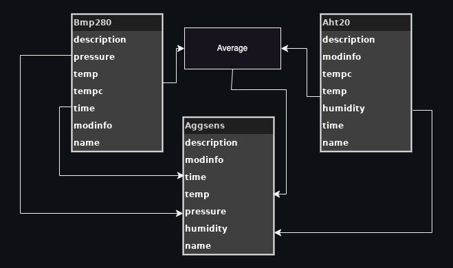

# Example of Virtual Sensor combinding values from two sensors and averaging common data.

This is an example of a virtual sensor with two sensors' readings combined into one dataset, 
as a new sensor. 

In this case, I have a HiLetgo AHT20/BMP280 combination sensor.
It shows on the I2C bus as two separate devices yet it is in one package. The difference between the sensors can be seen in the table below.

|Sensor|Temperature|Humidity|Barometer|
|------|-----------|--------|---------|
|AHT20 |      ✓    |   ✓    |    x    |
|BMP280|      ✓    |   x    |    ✓    |

To treat this as a single unit, the two temperatures are averaged, humidity and pressure 
readings are copyied, and the time is recorded in the return data.

Visually, this is our aggregate sensor.



```python
#!/usr/bin/env python3
import sys
import os
import time

import sensor
from sensorfs import dataToFs
import i2cdev
class sensor(sensor.Sensor):
	''' virtual sensor class to provide an aggregate of three sensor to one
	set of values. Temperature and Humidity are averaged
	'''
	def __init__(self,*args):
		super().__init__('aggregate',self._reader)
		self.aht = i2cdev.i2cdev(devaddr=i2cdev.I2C_AHT10)
		self.bmp = i2cdev.i2cdev(devaddr=i2cdev.I2C_BMP280)

	def _reader(self):
		ahtdata = self.aht.read()
		bmpdata = self.bmp.read()
		avgtemp = (ahtdata['temp']+bmpdata['temp'])/2.0
		self.data = {
			'description': 'Sensor Aggregation: bmp/aht temperature',
			'modinfo': 'com.ducksfeet.aggregate v0.1',
			'time': int(time.time()),
			'temp': avgtemp,
			'pressure': bmpdata['pressure'],
			'humidity': ahtdata['humidity'],
		}
		return self.data

class aggregate(sensor):
	pass

if __name__ == "__main__":
	s = aggregate()
	print(s.read())
```
